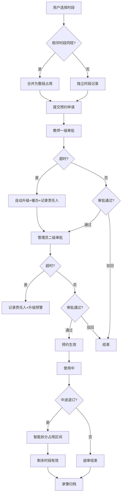

## 1. 产品概述

高校模拟法庭预约系统是一款面向法学院校的纯前端应用，解决模拟法庭教室资源调度、预约审批流程自动化、时段智能合并拆分等核心问题。系统服务于学生班级、教师、行政管理人员三类用户，实现庭审教学资源的高效管理与透明化运营。

## 2. 核心功能

### 2.1 用户角色

| 角色 | 注册方式 | 核心权限 |
|------|----------|----------|
| 学生班级 | 系统预置 | 提交预约申请、查看排期、退订预约、查看审批进度 |
| 指导教师 | 系统预置 | 一级审批、查看排期、催办升级、查看录像归档 |
| 教务管理员 | 系统预置 | 教室资源建档、二级审批、超时升级处理、系统配置、录像归档管理 |

### 2.2 功能模块

1. **教室排期模块**：法庭教室资源建档、周视图排期展示、时段状态可视化
2. **占用合并拆分模块**：相邻时段自动合并、中途退订智能拆分、合并状态标识
3. **预约审批模块**：两级审批流程、审批轨迹留痕、审批意见记录
4. **超时催办模块**：节点超时计时、自动升级催办、责任人记录、催办历史

### 2.3 页面详情

| 页面名称 | 模块名称 | 功能描述 |
|----------|----------|----------|
| 首页仪表盘 | 全局概览 | 待办审批数量、今日排期、超时预警、快速入口 |
| 教室排期页 | 教室排期模块 | 周视图排期、教室筛选、时段状态展示、预约入口 |
| 教室管理页 | 教室排期模块 | 法庭教室资源建档、CRUD操作、设备配置 |
| 预约申请页 | 占用合并拆分模块 | 多时段选择、班级信息填写、自动合并提示、预约提交 |
| 我的预约页 | 占用合并拆分模块 | 预约列表、合并状态展示、退订操作、拆分效果预览 |
| 审批工作台 | 预约审批模块 | 待审批列表、审批详情、审批操作、轨迹查看 |
| 超时催办页 | 超时催办模块 | 超时节点列表、升级记录、催办历史、责任人展示 |
| 录像归档页 | 庭审录像归档 | 录像列表、上传归档、关联预约、检索查询 |

## 3. 核心流程

用户提交多时段预约申请时，系统自动检测相邻时段是否为同一班级，若是则合并为整段占用记录。审批流程采用两级审批制，每级设置超时阈值，超时未处理则自动升级至上一级并触发催办通知，同时记录超时责任人。中途退订时，系统智能拆分合并的占用区间，保留有效时段。

## 4. 用户界面设计

### 4.1 设计风格
- **主色调**：深蓝色系 (#1e3a5f, #2c5282)，代表法律专业与权威
- **点缀色**：金色 (#d4af37)，象征庄重与荣誉
- **辅助色**：翡翠绿 (#059669) 表示已批准，琥珀橙 (#f59e0b) 表示待审批，玫瑰红 (#e11d48) 表示已驳回/超时
- **按钮风格**：圆角 6px，微立体阴影，hover 时轻微上浮 + 阴影加深
- **字体**：标题使用 Noto Serif SC 衬线体体现学术感，正文使用 Inter 无衬线体保证可读性
- **布局风格**：左右分栏布局，左侧导航固定 240px，右侧内容区采用卡片式网格布局
- **图标风格**：使用 Lucide 线性图标，保持简洁专业

### 4.2 页面设计概述

| 页面名称 | 模块名称 | UI元素 |
|----------|----------|--------|
| 首页仪表盘 | 全局概览 | 数据统计卡片、待办列表、今日时间轴、快捷操作区、渐变背景 |
| 教室排期页 | 教室排期模块 | 周视图时间表格、教室筛选标签、时段色块区分、合并时段特殊标识、悬停详情弹窗 |
| 教室管理页 | 教室排期模块 | 教室卡片网格、设备图标列表、增删改查操作表单、模态对话框 |
| 预约申请页 | 占用合并拆分模块 | 时段选择器、自动合并提示条、班级信息表单、合并预览时间轴 |
| 我的预约页 | 占用合并拆分模块 | 预约卡片列表、合并状态徽章、退订确认弹窗、拆分效果示意 |
| 审批工作台 | 预约审批模块 | 待办/已办标签切换、审批详情抽屉、轨迹时间轴、意见输入框 |
| 超时催办页 | 超时催办模块 | 超时预警红色高亮、责任人信息卡、升级时间轴、催办记录列表 |
| 录像归档页 | 庭审录像归档 | 视频卡片网格、上传区域、搜索过滤器、关联预约信息 |

### 4.3 响应性
采用桌面优先设计，主内容区最小宽度 1024px。平板端自动收起左侧导航为抽屉式菜单，移动端单列布局，表格组件转为卡片列表展示。所有交互元素确保触控尺寸不小于 44px。

### 4.4 动效设计
- 页面加载：内容区卡片采用 staggered 渐入动画，延迟 50ms 间隔
- 合并/拆分：时间轴色块平滑过渡动画，时长 300ms，缓动 cubic-bezier(0.4, 0, 0.2, 1)
- 审批轨迹：新审批节点出现时采用从下往上滑入 + 渐显
- 超时预警：超时卡片呼吸灯动画，红色光晕 pulse 效果
- 悬停交互：按钮上浮 2px + 阴影扩散，表格行背景色轻微加深
