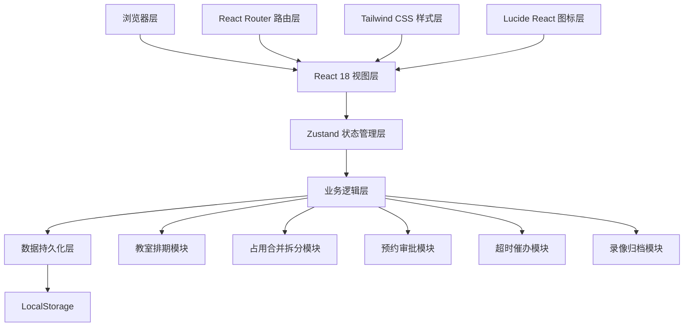
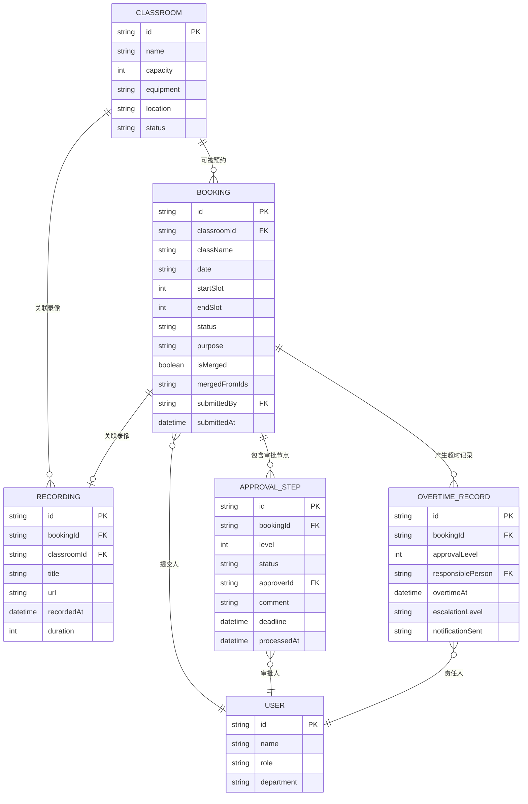

## 1. 架构设计

本项目为纯前端应用，采用单页应用（SPA）架构，所有业务逻辑和数据存储均在浏览器端完成，使用 LocalStorage 持久化存储。



## 2. 技术描述

- **前端框架**: React@18 + TypeScript@5
- **构建工具**: Vite@5
- **状态管理**: Zustand@4
- **路由管理**: react-router-dom@6
- **样式方案**: Tailwind CSS@3
- **图标库**: lucide-react@0.344
- **持久化方案**: LocalStorage + zustand-persist
- **日期处理**: date-fns@3
- **无后端服务，纯前端模拟**

## 3. 路由定义

| 路由路径 | 页面组件 | 访问权限 |
|----------|----------|----------|
| `/` | 仪表盘首页 | 所有角色 |
| `/schedule` | 教室排期页 | 所有角色 |
| `/classrooms` | 教室管理页 | 管理员 |
| `/booking` | 预约申请页 | 学生班级 |
| `/my-bookings` | 我的预约页 | 学生班级 |
| `/approval` | 审批工作台 | 教师、管理员 |
| `/overtime` | 超时催办页 | 管理员 |
| `/recordings` | 录像归档页 | 所有角色 |

## 4. 数据模型

### 4.1 实体关系图



### 4.2 核心类型定义

```typescript
// 时段定义：每天8个时段，每时段90分钟
// 1: 08:00-09:30, 2: 09:45-11:15, 3: 13:00-14:30, 4: 14:45-16:15
// 5: 16:30-18:00, 6: 19:00-20:30, 7: 20:45-22:15

type TimeSlot = 1 | 2 | 3 | 4 | 5 | 6 | 7;

interface Classroom {
  id: string;
  name: string;
  capacity: number;
  equipment: string[];
  location: string;
  status: 'active' | 'maintenance';
}

interface Booking {
  id: string;
  classroomId: string;
  className: string;
  date: string;
  startSlot: TimeSlot;
  endSlot: TimeSlot;
  status: 'pending' | 'approved' | 'rejected' | 'cancelled' | 'completed';
  purpose: string;
  isMerged: boolean;
  mergedFromIds: string[];
  submittedBy: string;
  submittedAt: string;
  approvalSteps: ApprovalStep[];
  overtimeRecords: OvertimeRecord[];
}

interface ApprovalStep {
  id: string;
  bookingId: string;
  level: 1 | 2;
  status: 'pending' | 'approved' | 'rejected' | 'escalated' | 'overtime';
  approverId: string | null;
  comment: string;
  deadline: string;
  processedAt: string | null;
}

interface OvertimeRecord {
  id: string;
  bookingId: string;
  approvalLevel: 1 | 2;
  responsiblePersonId: string;
  overtimeAt: string;
  escalationLevel: 1 | 2 | 3;
  notificationSent: boolean;
  message: string;
}

interface Recording {
  id: string;
  bookingId: string | null;
  classroomId: string;
  title: string;
  videoUrl: string;
  recordedAt: string;
  duration: number;
  caseType: string;
}

interface User {
  id: string;
  name: string;
  role: 'student' | 'teacher' | 'admin';
  department: string;
}
```

## 5. 状态管理设计

使用 Zustand 管理全局状态，按模块拆分 store：

### 5.1 Store 结构

```typescript
interface AppState {
  // 数据
  classrooms: Classroom[];
  bookings: Booking[];
  recordings: Recording[];
  users: User[];
  currentUser: User | null;
  
  // UI 状态
  selectedDate: string;
  selectedClassroom: string | null;
  isBookingModalOpen: boolean;
  
  // 动作 - 教室管理
  addClassroom: (c: Omit<Classroom, 'id'>) => void;
  updateClassroom: (id: string, c: Partial<Classroom>) => void;
  deleteClassroom: (id: string) => void;
  
  // 动作 - 预约管理
  createBooking: (b: CreateBookingParams) => Booking[];
  cancelBooking: (id: string, cancelSlots?: TimeSlot[]) => Booking[];
  
  // 动作 - 审批管理
  processApproval: (stepId: string, status: 'approved' | 'rejected', comment: string) => void;
  checkAndProcessOvertime: () => void;
  
  // 动作 - 录像管理
  addRecording: (r: Omit<Recording, 'id'>) => void;
}
```

### 5.2 核心业务逻辑

#### 合并逻辑（mergeAdjacentBookings）
- 输入：待创建的预约列表
- 处理：按日期和教室分组，检测同一班级的相邻时段
- 输出：合并后的预约列表，isMerged=true，mergedFromIds 记录来源

#### 拆分逻辑（splitBookingOnCancel）
- 输入：预约ID，要取消的时段列表
- 处理：从原预约中移除指定时段，剩余时段若不连续则拆分为多个预约
- 输出：拆分后的预约列表

#### 超时检测逻辑（checkOvertimeApprovals）
- 轮询间隔：每分钟（模拟）
- 检测：approvalStep.deadline < 当前时间 且 status='pending'
- 处理：标记 overtime，创建 OvertimeRecord，自动升级审批级别

## 6. 目录结构

```
src/
├── components/          # 公共组件
│   ├── Layout/         # 布局组件
│   ├── Schedule/       # 排期相关组件
│   ├── Booking/        # 预约相关组件
│   ├── Approval/       # 审批相关组件
│   ├── Overtime/       # 超时相关组件
│   └── ui/             # 基础UI组件（Button, Card, Modal等）
├── pages/              # 页面组件
│   ├── Dashboard.tsx
│   ├── Schedule.tsx
│   ├── ClassroomManage.tsx
│   ├── BookingApply.tsx
│   ├── MyBookings.tsx
│   ├── ApprovalWorkbench.tsx
│   ├── OvertimeCenter.tsx
│   └── Recordings.tsx
├── store/              # Zustand store
│   ├── index.ts
│   └── persist.ts
├── types/              # TypeScript 类型定义
│   └── index.ts
├── utils/              # 工具函数
│   ├── time.ts         # 时段转换
│   ├── merge.ts        # 合并拆分逻辑
│   ├── approval.ts     # 审批逻辑
│   └── overtime.ts     # 超时逻辑
├── data/               # Mock 数据
│   └── mockData.ts
├── hooks/              # 自定义 Hooks
│   ├── useOvertimeCheck.ts
│   └── useBookingMerge.ts
├── router/             # 路由配置
│   └── index.tsx
├── App.tsx
└── main.tsx
```

## 7. 关键算法

### 7.1 相邻时段合并算法

```
输入: bookings: Booking[]
输出: mergedBookings: Booking[]

1. 按 date + classroomId + className 分组
2. 对每组按时段排序
3. 检测连续时段: 如果 booking[i].endSlot + 1 == booking[i+1].startSlot
4. 合并连续时段: startSlot = min, endSlot = max
5. 标记 isMerged = true, 记录 mergedFromIds
6. 返回合并后的列表
```

### 7.2 退订拆分算法

```
输入: bookingId: string, cancelSlots: TimeSlot[]
输出: newBookings: Booking[]

1. 获取原预约的所有时段 [startSlot ... endSlot]
2. 移除 cancelSlots 中的时段
3. 将剩余时段分组为连续块
4. 为每个连续块创建新预约
5. 标记 isMerged = (slotCount > 1)
6. 删除原预约
7. 返回新预约列表
```

### 7.3 超时升级算法

```
1. 遍历所有 approvalSteps where status = 'pending'
2. 计算当前时间与 deadline 的差值
3. 超时 < 1小时: 标记预警，发送提醒
4. 超时 1-4小时: 自动升级到下一级审批，记录责任人
5. 超时 > 4小时: 升级至最高级管理员，发送紧急通知
6. 每次超时创建 OvertimeRecord 留痕
```
